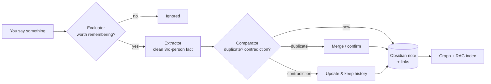
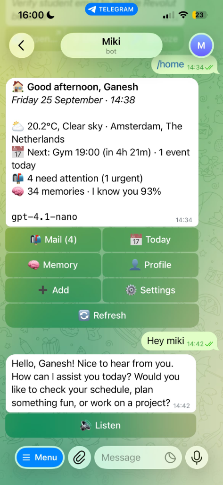
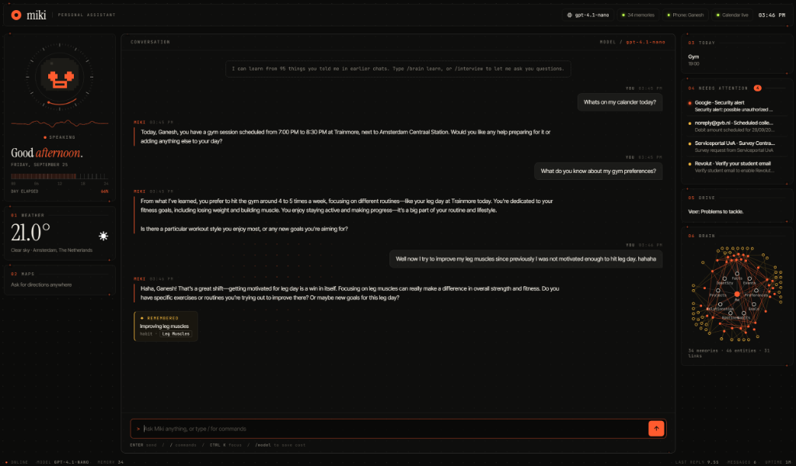
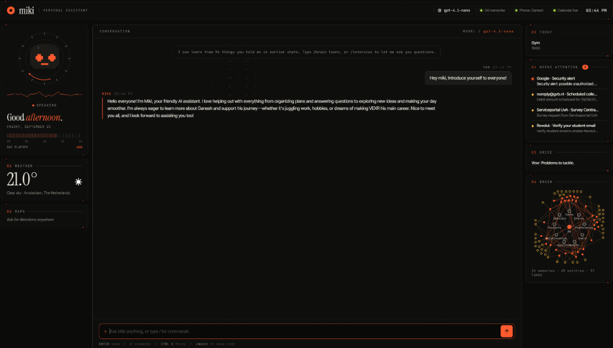
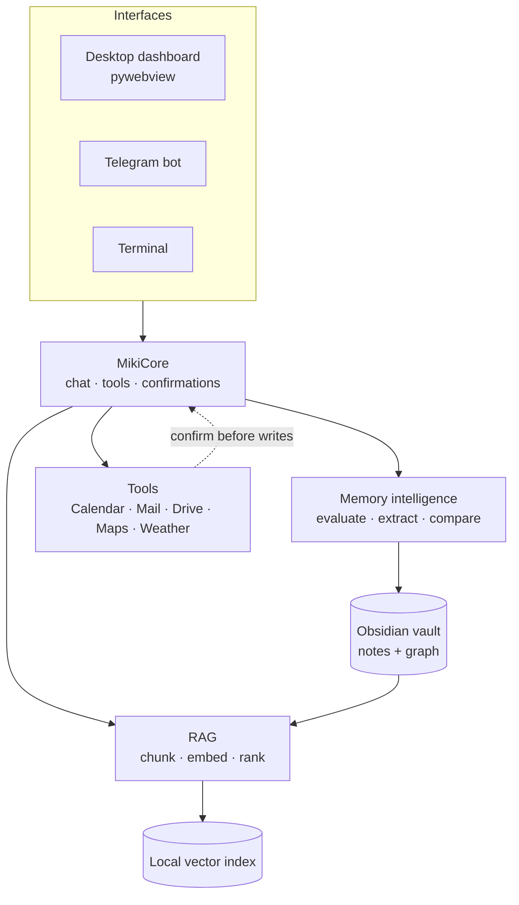

<div align="center">

# Miki

### The personal AI that actually remembers you.

**Graph memory in Obsidian · RAG that ranks, not just searches · Calendar & mail that ask before they act · On your phone via Telegram**


<a href="assets/demo/miki-demo.mp4">
  
</a>

<sub>Graph memory, RAG and calendar in 50 seconds. <a href="assets/demo/miki-demo.mp4"><b>Watch with sound</b></a> · names and data in the demo are fictional.</sub>

</div>

---

## Why Miki?

Most assistants are chatbots with amnesia. Every conversation starts from zero, and "memory" usually means a pile of text pasted into a prompt.

Miki is built around one idea: **an assistant should know you, and you should be able to see exactly what it knows.**

| | Typical chatbot | **Miki** |
|---|---|---|
| Memory | Forgets, or a hidden blob | Linked Markdown notes in **your** Obsidian vault |
| Recall | Keyword or nothing | RAG scored on relevance, importance, confidence, recency |
| Actions | Acts, or can't | Acts, **after you confirm** |
| Where it runs | Someone else's cloud | **Your machine** |
| Reach | One tab | Desktop dashboard **and** your phone |
| Code | Closed | **Open source** |

---

## ✨ Features

### 🧠 Memory that works like a brain
Miki doesn't log everything you say. A small pipeline decides what is worth keeping:



- **A real graph.** People, places, interests and habits become notes, connected by `[[wikilinks]]` around a central `Me` hub. Open Obsidian's graph view and watch how Miki understands your life, colour-coded by type.
- **Always-on recall.** The most relevant memories are woven into every reply, so you never have to say "remember when I told you…".
- **Knows who you are.** A living profile, a get-to-know-you `/interview`, a background learner that notices patterns, and a daily journal note that links back to the people and topics it mentions.
- **You stay in control.** Uncertain memories wait for your approval (`/candidates`). Deleted memories are archived, never silently destroyed. Every note is plain Markdown you can read and edit.

### 🔎 RAG that ranks, not just searches
Miki retrieves from three sources at once: her **memories**, your **Obsidian vault** and **past conversations**, using a local vector index (no external vector database).

Every candidate is scored by a transparent weighted blend, so *relevant and current* beats *merely similar*:

| Signal | Weight |
|---|---|
| Semantic similarity | 0.55 |
| Importance | 0.20 |
| Confidence | 0.10 |
| Recency (180-day half-life) | 0.10 |
| Stability | 0.05 |

Each source also has its own trust multiplier (memory > vault > conversation).

### 📅 Calendar & mail that act, but ask first
- **Google Calendar:** read across multiple calendars, create and delete events. Anything that writes shows a confirmation card first.
- **Mail that needs attention:** Miki triages your inbox with rules plus one batched LLM call, surfaces only what needs a reply, and opens the exact email in Gmail with one click. Dismiss or snooze the rest.
- **Also built in:** weather (Open-Meteo, no API key), Google Drive and Maps tools, all behind the same tool-calling layer.

### 📱 Miki on your phone
A real Telegram bot, not just a chat window:

<p align="center">
  
</p>

- Text or **voice notes**. Miki transcribes them and can answer with voice.
- **Urgent mail pushed to you** with *Open in Gmail / Dismiss / Snooze* buttons.
- Inline keyboards and slash commands: `/home` `/today` `/brief` `/mail` `/memory` `/profile`.
- **Quiet hours** and rate limits so it never spams you.
- **Locked to you.** Pair once with a one-time code. Group chats and unlinked accounts are ignored.

### 🖥️ A dashboard worth looking at
A lightweight, futuristic Command Center: animated pixel mascot, an interactive memory map, and live widgets for Calendar, Mail, Weather, Maps and Drive. Built to stay light: idle animations are gated so a resting dashboard uses almost no CPU.

<p align="center">
  
</p>
<p align="center">
  
</p>

### 🔒 Private by design
Everything lives in `data/`, your Obsidian vault or your `.env`. There is **no telemetry** and Miki never phones home. The only outside calls are to the services you enable: OpenAI for the model and embeddings, Google for Calendar, Mail and Drive, and Telegram for the phone bot.

---

## 🚀 Quick start

**Requirements:** Python 3.11+, an OpenAI API key. Obsidian, Google and Telegram are optional.

```bash
git clone https://github.com/ganeshvolchenkov/miki.git
cd miki

python -m venv .venv
# Windows PowerShell
.\.venv\Scripts\Activate.ps1
# macOS / Linux
# source .venv/bin/activate

pip install -r requirements.txt
```

Create a `.env` in the project root (only `OPENAI_API_KEY` is required):

```env
OPENAI_API_KEY=your_key_here
MIKI_MODEL=gpt-4o-mini
OBSIDIAN_VAULT_PATH=C:\Users\<you>\Documents\MyVault
MIKI_TIMEZONE=Europe/Berlin
```

Launch:

```bash
pythonw miki.pyw            # Windows: opens the Command Center (or double-click it)
MIKI_UI=cli python -m app.main   # terminal chat instead of the dashboard
```

<details>
<summary><b>All configuration options</b></summary>

| Variable | What it does |
|---|---|
| `OPENAI_API_KEY` | **Required.** Your OpenAI key |
| `MIKI_MODEL` | Chat model (switch live with `/model`) |
| `MIKI_MEMORY_MODEL` | Model used by the memory pipeline |
| `MIKI_EMBEDDING_MODEL` | Embedding model for RAG (`text-embedding-3-small` default) |
| `OBSIDIAN_VAULT_PATH` | Where the memory graph is written |
| `MIKI_TIMEZONE` | Your timezone |
| `MIKI_RAG_ENABLED` | Turn RAG on or off |
| `MIKI_RAG_TOP_K`, `MIKI_RAG_SIMILARITY_THRESHOLD` | Retrieval breadth and cut-off |
| `MIKI_RAG_CHUNK_SIZE`, `MIKI_RAG_CHUNK_OVERLAP` | Chunking |
| `MIKI_MEMORY_INTELLIGENCE_ENABLED` | Smart memory pipeline |
| `MIKI_MEMORY_CONFIDENT_THRESHOLD`, `MIKI_MEMORY_CANDIDATE_THRESHOLD` | Auto-save vs ask-me cut-offs |
| `MIKI_CALENDAR_ENABLED`, `MIKI_GOOGLE_CALENDAR_ID` | Calendar tool (comma-separate several calendars to read; writes go to the first) |
| `MIKI_CALENDAR_REQUIRE_CREATE_CONFIRMATION` | Confirmation before creating events |
| `MIKI_MAIL_TRIAGE`, `MIKI_MAIL_WATCH_SECONDS` | Mail triage and push polling |
| `MIKI_WEATHER_ENABLED` | Weather tool |
| `TELEGRAM_BOT_TOKEN`, `MIKI_QUIET_HOURS` | Phone bot and its quiet hours (e.g. `23:00-08:00`) |
| `MIKI_TTS_MODEL`, `MIKI_TTS_VOICE`, `MIKI_TRANSCRIBE_MODEL` | Voice replies and voice-note transcription |
| `MIKI_GPU` | Opt in to GPU rendering (off by default to save RAM) |

</details>

### Connect Google (Calendar, Mail, Drive)
1. Create a **Desktop** OAuth client in the [Google Cloud Console](https://console.cloud.google.com/).
2. Save the JSON as `data/google_calendar/credentials.json`.
3. In Miki, type `/calendar connect` and approve in the browser.

> 💡 If your OAuth app is in *Testing* mode, Google expires refresh tokens after 7 days. Publish the app (personal use is fine) to stay connected.

### Put Miki on your phone
1. In Telegram, open **@BotFather**, send `/newbot`, and copy the token.
2. Add `TELEGRAM_BOT_TOKEN=...` to `.env` and restart Miki.
3. Type `/phone` in the dashboard. You get a one-time code (valid 10 minutes).
4. In your new bot, send `/pair <code>`. Done.

### Keep her running 24/7
```bash
python -m app.headless                      # run in the foreground
python -m app.headless --install-autostart  # start silently at Windows login
python -m app.headless --remove-autostart   # remove from startup
```

---

## 💬 Commands

| Command | What it does |
|---|---|
| `/remember <fact>` | Store a memory explicitly |
| `/memory [word]` | See or search what Miki remembers |
| `/forget <id>` | Delete (archive) a memory |
| `/candidates` | Review uncertain memories Miki wants your OK on |
| `/profile` | Who Miki thinks you are |
| `/interview` | Miki asks questions to get to know you |
| `/brain rebuild` | Rebuild the memory graph and vector index |
| `/sync` | Refresh the memory store from the vault |
| `/mail` | Emails that need your attention |
| `/calendar connect` | (Re)authorize Google Calendar |
| `/weather [place]` | Instant weather |
| `/model` | Switch the OpenAI model on the fly to control cost |
| `/phone` | Pair Miki with your phone |

Or just talk to her. Slash commands are optional.

---

## 🏗 How it fits together



```text
app/
├── core/         chat loop, memory manager, profile, interview, journal, mail triage
├── memory/       Obsidian writer, graph, note models
├── rag/          chunking, embeddings, index, retriever, ranking
├── tools/        calendar, mail, drive, maps, weather (+ registry)
├── phone/        Telegram API, bot, notifier, headless service
└── interfaces/   web dashboard (HTML/CSS/JS), face, commands
```

- **Local vector index:** brute-force cosine similarity over a local file. Ideal for personal-scale data, with no vector DB to run.
- **Graph:** built with `networkx` from your notes and links.
- **Tools:** OpenAI structured function calling. Anything that writes or deletes goes through a confirmation step.

---

## 🗺 Ideas on the horizon

Not promises, just where I'm poking next:
- A **day planner** that connects calendar, mail and memory into a morning plan
- A **shopping agent** that learns what you like
- Easier always-on **hosting** (Linux/Docker)
- Drafting **email replies** for you to approve

Got an idea? Open an issue.

---

## 🤝 Contributing

Miki is open source and contributions are welcome: bug reports, ideas, docs, tools, and new memory or RAG strategies.

1. Fork the repo and create a branch: `git checkout -b feature/my-idea`
2. Make your change (keep tools confirmation-first for anything that writes)
3. Open a pull request describing what and why

New tools live in `app/tools/` and register through `app/tools/registry.py`.

## 📄 License

[MIT](LICENSE). Use it, fork it, make it yours.

<div align="center">
<sub>Built by <a href="https://github.com/ganeshvolchenkov">Ganesh</a> because an assistant should remember you, and you should be able to see what it remembers.</sub>
</div>
