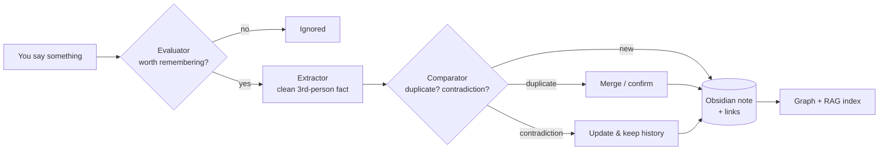
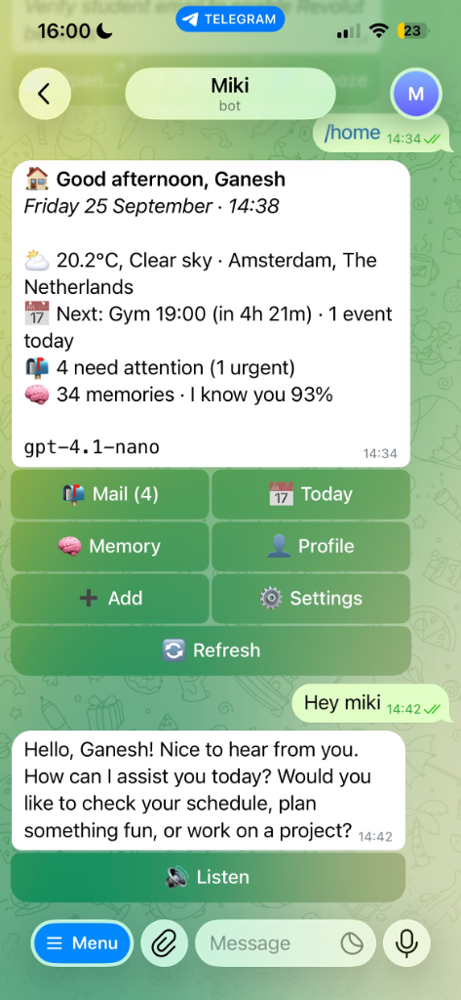
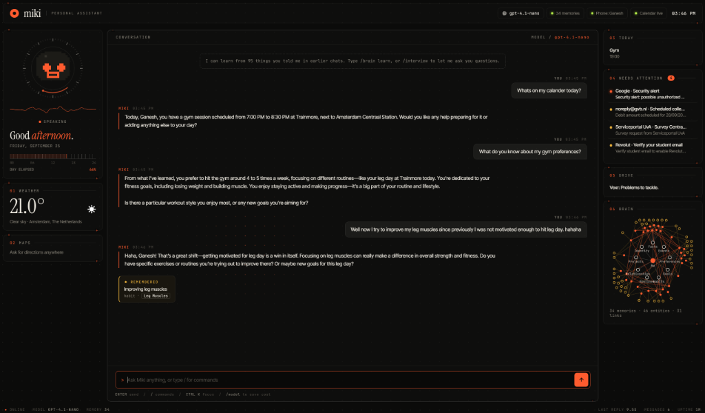
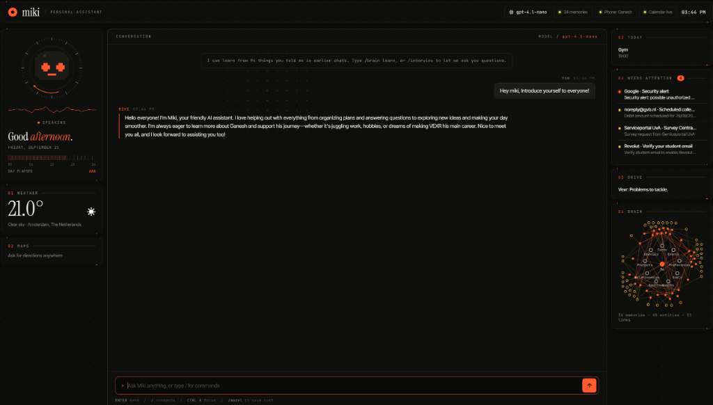
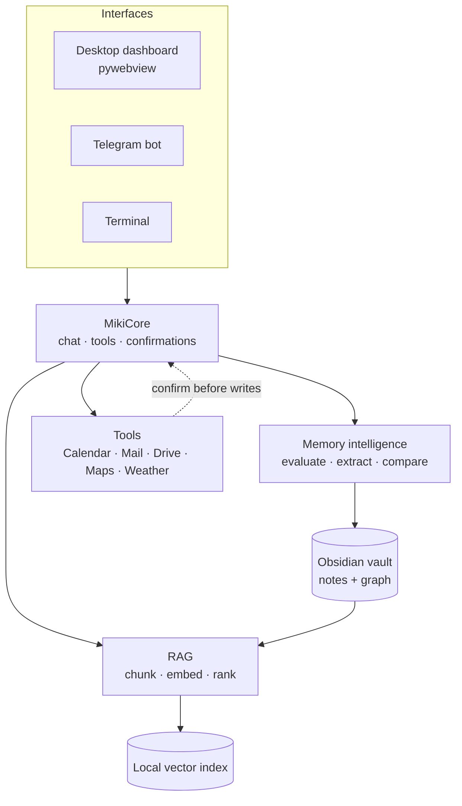

<div align="center">

# Miki

### The personal AI that actually remembers you.

**Graph memory in Obsidian · RAG that ranks, not just searches · Calendar & mail that ask before they act · On your phone via Telegram**


<a href="assets/demo/miki-demo.mp4">
  
</a>

<sub>Graph memory, RAG and calendar in 50 seconds. <a href="assets/demo/miki-demo.mp4"><b>Watch with sound</b></a> · names and data in the demo are fictional.</sub>

</div>

---

## Why Miki?

Most assistants are chatbots with amnesia. Every conversation starts from zero, and "memory" usually means a pile of text pasted into a prompt.

Miki is built around one idea: **an assistant should know you, and you should be able to see exactly what it knows.**

| | Typical chatbot | **Miki** |
|---|---|---|
| Memory | Forgets, or a hidden blob | Linked Markdown notes in **your** Obsidian vault |
| Recall | Keyword or nothing | RAG scored on relevance, importance, confidence, recency |
| Actions | Acts, or can't | Acts, **after you confirm** |
| Where it runs | Someone else's cloud | **Your machine** |
| Reach | One tab | Desktop dashboard **and** your phone |
| Code | Closed | **Open source** |

---

## ✨ Features

### 🧠 Memory that works like a brain
Miki doesn't log everything you say. A small pipeline decides what is worth keeping:


```mermaid
flowchart LR
    A[You say something] --> B{Evaluator<br/>worth remembering?}
    B -- no --> X[Ignored]
    B -- yes --> C[Extractor<br/>clean 3rd-person fact]
    C --> D{Comparator<br/>duplicate? contradiction?}
    D -- duplicate --> E[Merge / confirm]
    D -- contradiction --> F[Update & keep history]
    D -- new --> G[(Obsidian note<br/>+ links)]
    E --> G
    F --> G
    G --> H[Graph + RAG index]
```

- **A real graph.** People, places, interests and habits become notes, connected by `[[wikilinks]]` around a central `Me` hub. Open Obsidian's graph view and watch how Miki understands your life, colour-coded by type.
- **Always-on recall.** The most relevant memories are woven into every reply, so you never have to say "remember when I told you…".
- **Knows who you are.** A living profile, a get-to-know-you `/interview`, a background learner that notices patterns, and a daily journal note that links back to the people and topics it mentions.
- **You stay in control.** Uncertain memories wait for your approval (`/candidates`). Deleted memories are archived, never silently destroyed. Every note is plain Markdown you can read and edit.

### 🔎 RAG that ranks, not just searches
Miki retrieves from three sources at once: her **memories**, your **Obsidian vault** and **past conversations**, using a local vector index (no external vector database).

Every candidate is scored by a transparent weighted blend, so *relevant and current* beats *merely similar*:

| Signal | Weight |
|---|---|
| Semantic similarity | 0.55 |
| Importance | 0.20 |
| Confidence | 0.10 |
| Recency (180-day half-life) | 0.10 |
| Stability | 0.05 |

Each source also has its own trust multiplier (memory > vault > conversation).

### 📅 Calendar & mail that act, but ask first
- **Google Calendar:** read across multiple calendars, create and delete events. Anything that writes shows a confirmation card first.
- **Mail that needs attention:** Miki triages your inbox with rules plus one batched LLM call, surfaces only what needs a reply, and opens the exact email in Gmail with one click. Dismiss or snooze the rest.
- **Also built in:** weather (Open-Meteo, no API key), Google Drive and Maps tools, all behind the same tool-calling layer.

### 📱 Miki on your phone
A real Telegram bot, not just a chat window:

<p align="center">
  
</p>

- Text or **voice notes**. Miki transcribes them and can answer with voice.
- **Urgent mail pushed to you** with *Open in Gmail / Dismiss / Snooze* buttons.
- Inline keyboards and slash commands: `/home` `/today` `/brief` `/mail` `/memory` `/profile`.
- **Quiet hours** and rate limits so it never spams you.
- **Locked to you.** Pair once with a one-time code. Group chats and unlinked accounts are ignored.

### 🎯 Focus mode
Text Miki `/focus` (from your phone or the dashboard) and she sets your desk up for studying:

- **Screens arranged for you.** Gemini on Screen 1, Claude on Screen 2, in a Chrome that Miki can see into. Everything else is tucked away.
- **A ban list, not a straitjacket.** YouTube, TikTok, Instagram, Reddit, Netflix, Discord, Steam and friends are banned; everything else (your editor, notes, PDFs, Wikipedia) is left alone. Banned tabs are closed, banned apps minimised, and an everyday browser window showing a banned site is minimised too. Nothing is ever killed and no system setting changes, so if Miki stops you are instantly free.
- **A little pixel Miki as a progress bar.** It stands on a slim bar along the bottom of your primary screen, which fills from the left corner to the right corner over the round: when Miki reaches the right corner, you're done. It stays put and only reacts when you wander off ("Nope, YouTube can wait!") and when you finish. **Click it to open the snipping tool** and grab a screenshot (right-click shows the time left). It runs as its own ~30 MB process.
- **A break after an hour.** Miki pings your phone and desktop, lifts the lock for 5 minutes, then asks about another round. Urgent-mail pushes wait until you are done.
- **Say how long in plain words.** `/focus 1 hour`, `/focus 30 mins`, `/focus 1h30`, `/focus half an hour`. Common forms are read instantly and offline; for anything stranger (`/focus until 3pm`, `/focus a pomodoro`) Miki asks the AI, tells you what it understood, and checks the answer is between 5 minutes and 4 hours.
- **An end-of-day recap.** Each evening (21:00 by default, only on days you focused) Miki tells you how long you focused, when you started, when you finished, every round, what she bounced, and how that compares with your usual. Ask any time with `/focus today`.
- **She learns how you study.** A single "Study habits" memory in your Obsidian brain is updated in place after every round (typical start and finish, usual round length, best time of day, your biggest distractions, streak), and a `<day> focus.md` note lands in the vault's Journal folder so you can ask "how much did I study last Tuesday?". Patterns are only claimed with a few days of evidence. Delete the memory and Miki stops (`/focus habits reset` restarts it).
- **Always know what is blocked.** `/focus banned` lists every banned site and app.
- **Stats.** Distractions bounced, focus minutes today and a day streak.

Commands: `/focus` · `/focus 1 hour` · `/focus 30 mins` · `/focus more [half an hour]` · `/focus stop` · `/focus status` · `/focus today` · `/focus stats` · `/focus habits` · `/focus banned` · `/focus ban <site or app>` · `/focus unban <site or app>`. Banning is always allowed; lifting a ban only works between sessions, so you can't talk yourself out of focus mid-round.

On the first run, sign in to Gemini and Claude once in the Chrome window Miki opens (it uses its own profile in `data/focus-chrome`, so your everyday Chrome is untouched). Settings live in `.env`:

| Setting | Meaning |
|---|---|
| `MIKI_FOCUS_BAN=9anime.to,obsidian` | Extra bans: a name with a dot is a website, anything else is a program |
| `MIKI_FOCUS_MINUTES=60` / `MIKI_FOCUS_BREAK_MINUTES=5` | Default round and break length |
| `MIKI_FOCUS_RECAP_TIME=21:00` | When the end-of-day recap goes out (`off` to disable) |
| `MIKI_FOCUS_SCREEN1_URL` / `MIKI_FOCUS_SCREEN2_URL` | What opens on each screen |
| `MIKI_FOCUS_SWAP_SCREENS=1` | Swap which monitor is "Screen 1" (default: the primary one) |
| `MIKI_CHROME_PATH`, `MIKI_FOCUS=0` | Chrome location; switch focus mode off |

### 📋 Plan your day in plain English
Tell Miki how you want the day to go and she works out a timeline that actually fits:

> `/plan I want to study 8 hours, 5 linear algebra and 3 calculus, with a 50 minute lunch break. I also want to hit the gym, and be home at 8pm for dinner.`

- **The AI only reads, code does the clock.** The sentence becomes a list of wishes; a scheduler then lays them out: trips between places, study as focus-sized rounds with breaks, lunch at the break closest to lunchtime, and whatever is already in your calendar left alone. It tries every sensible order (gym before, after, or in the middle of studying) and keeps the one that's on time with the least travel.
- **It tells you when it can't fit.** "⚠️ 1h late for dinner at 20:00", and changes it checked that *would* fit: "Study 7h instead of 8h: home by 19:55", "Skip gym: home by 19:30".
- **It knows your places.** Teach it once: `/plan remember school and the gym are 50 min from home, the gym is 15 min from school, I spend 1h15 at the gym, and I study at school`. Travel facts you mention in a request are remembered too; `/plan places` shows them.
- **Change it in words.** "✏️ Change" (or `/plan gym after studying`) edits the draft; `/plan new …` starts over.
- **"Looks good" puts it in Google Calendar** (one event per block, marked as Miki's, removed again if you replace or cancel the plan).
- **Then it guides you.** "🚶 Time to leave for school", "📚 Linear algebra now, until 12:30 [▶️ Focus 60 min]". Each nudge goes out once; ones missed while Miki was off are skipped, not sent late.

Commands: `/plan <your day>` · `/plan ok` · `/plan` (show) · `/plan cancel` · `/plan places` · `/plan remember <facts>` · `/plan new <your day>`. The reading model is `MIKI_PLAN_MODEL` (default `gpt-4.1-mini`); `MIKI_PLAN=0` switches it off.

### 🖥️ A dashboard worth looking at
A lightweight, futuristic Command Center: animated pixel mascot, an interactive memory map, and live widgets for Calendar, Mail, Weather, Maps and Drive. Built to stay light: idle animations are gated so a resting dashboard uses almost no CPU.

<p align="center">
  
</p>
<p align="center">
  
</p>

### 🔒 Private by design
Everything lives in `data/`, your Obsidian vault or your `.env`. There is **no telemetry** and Miki never phones home. The only outside calls are to the services you enable: OpenAI for the model and embeddings, Google for Calendar, Mail and Drive, and Telegram for the phone bot.

---

## 🚀 Quick start

**Requirements:** Python 3.11+, an OpenAI API key. Obsidian, Google and Telegram are optional.

```bash
git clone https://github.com/ganeshvolchenkov/miki.git
cd miki

python -m venv .venv
# Windows PowerShell
.\.venv\Scripts\Activate.ps1
# macOS / Linux
# source .venv/bin/activate

pip install -r requirements.txt
```

Create a `.env` in the project root (only `OPENAI_API_KEY` is required):

```env
OPENAI_API_KEY=your_key_here
MIKI_MODEL=gpt-4o-mini
OBSIDIAN_VAULT_PATH=C:\Users\<you>\Documents\MyVault
MIKI_TIMEZONE=Europe/Berlin
```

Launch:

```bash
pythonw miki.pyw            # Windows: opens the Command Center (or double-click it)
MIKI_UI=cli python -m app.main   # terminal chat instead of the dashboard
```

<details>
<summary><b>All configuration options</b></summary>

| Variable | What it does |
|---|---|
| `OPENAI_API_KEY` | **Required.** Your OpenAI key |
| `MIKI_MODEL` | Chat model (switch live with `/model`) |
| `MIKI_MEMORY_MODEL` | Model used by the memory pipeline |
| `MIKI_EMBEDDING_MODEL` | Embedding model for RAG (`text-embedding-3-small` default) |
| `OBSIDIAN_VAULT_PATH` | Where the memory graph is written |
| `MIKI_TIMEZONE` | Your timezone |
| `MIKI_RAG_ENABLED` | Turn RAG on or off |
| `MIKI_RAG_TOP_K`, `MIKI_RAG_SIMILARITY_THRESHOLD` | Retrieval breadth and cut-off |
| `MIKI_RAG_CHUNK_SIZE`, `MIKI_RAG_CHUNK_OVERLAP` | Chunking |
| `MIKI_MEMORY_INTELLIGENCE_ENABLED` | Smart memory pipeline |
| `MIKI_MEMORY_CONFIDENT_THRESHOLD`, `MIKI_MEMORY_CANDIDATE_THRESHOLD` | Auto-save vs ask-me cut-offs |
| `MIKI_CALENDAR_ENABLED`, `MIKI_GOOGLE_CALENDAR_ID` | Calendar tool (comma-separate several calendars to read; writes go to the first) |
| `MIKI_CALENDAR_REQUIRE_CREATE_CONFIRMATION` | Confirmation before creating events |
| `MIKI_MAIL_TRIAGE`, `MIKI_MAIL_WATCH_SECONDS` | Mail triage and push polling |
| `MIKI_WEATHER_ENABLED` | Weather tool |
| `TELEGRAM_BOT_TOKEN`, `MIKI_QUIET_HOURS` | Phone bot and its quiet hours (e.g. `23:00-08:00`) |
| `MIKI_TTS_MODEL`, `MIKI_TTS_VOICE`, `MIKI_TRANSCRIBE_MODEL` | Voice replies and voice-note transcription |
| `MIKI_GPU` | Opt in to GPU rendering (off by default to save RAM) |

</details>

### Connect Google (Calendar, Mail, Drive)
1. Create a **Desktop** OAuth client in the [Google Cloud Console](https://console.cloud.google.com/).
2. Save the JSON as `data/google_calendar/credentials.json`.
3. In Miki, type `/calendar connect` and approve in the browser.

> 💡 If your OAuth app is in *Testing* mode, Google expires refresh tokens after 7 days. Publish the app (personal use is fine) to stay connected.

### Put Miki on your phone
1. In Telegram, open **@BotFather**, send `/newbot`, and copy the token.
2. Add `TELEGRAM_BOT_TOKEN=...` to `.env` and restart Miki.
3. Type `/phone` in the dashboard. You get a one-time code (valid 10 minutes).
4. In your new bot, send `/pair <code>`. Done.

### Keep her running 24/7: a brain on a server, hands on your laptop
Miki can live on an always-on Linux server (the **brain**: chat, memory, mail, calendar, the phone bot,
the focus clock) while your laptop is only her **hands** (the dashboard window, plus a small agent that
arranges your screens and bounces distractions during `/focus`). There is one memory, on the server,
and your phone and laptop both talk to it.

- The brain listens only on the server's loopback. The laptop reaches it through an **SSH tunnel** with
  the key you already log in with, plus a shared `MIKI_LINK_TOKEN`. No new port is open to the internet.
- `/focus` from your phone sets up your laptop's screens. If the laptop is off, Miki says so. If the
  connection drops, the laptop stops guarding by itself when the round's time is up.

```bash
python -m app.link token                   # make the shared secret (same value in both .env files)
python -m app.headless                     # on the server: the brain (with MIKI_LINK_TOKEN set)
python -m app.hands --install-autostart    # on the laptop: the hands at login (with MIKI_SERVER set)
```

Full step-by-step guide: [docs/deploy-contabo.md](docs/deploy-contabo.md).

---

## 💬 Commands

| Command | What it does |
|---|---|
| `/remember <fact>` | Store a memory explicitly |
| `/memory [word]` | See or search what Miki remembers |
| `/forget <id>` | Delete (archive) a memory |
| `/candidates` | Review uncertain memories Miki wants your OK on |
| `/profile` | Who Miki thinks you are |
| `/interview` | Miki asks questions to get to know you |
| `/brain rebuild` | Rebuild the memory graph and vector index |
| `/sync` | Refresh the memory store from the vault |
| `/mail` | Emails that need your attention |
| `/calendar connect` | (Re)authorize Google Calendar |
| `/weather [place]` | Instant weather |
| `/model` | Switch the OpenAI model on the fly to control cost |
| `/phone` | Pair Miki with your phone |
| `/focus [minutes\|stop]` | Study mode: screens set up, distractions blocked, a break after an hour |
| `/plan <your day>` | Plan the day in plain English; `/plan ok` locks it in and adds it to your calendar |

Or just talk to her. Slash commands are optional.

---

## 🏗 How it fits together


```mermaid
flowchart TB
    subgraph UI[Interfaces]
      D[Desktop dashboard<br/>pywebview]
      T[Telegram bot]
      C[Terminal]
    end
    UI --> CORE[MikiCore<br/>chat · tools · confirmations]
    CORE --> MEM[Memory intelligence<br/>evaluate · extract · compare]
    CORE --> RAG[RAG<br/>chunk · embed · rank]
    CORE --> TOOLS[Tools<br/>Calendar · Mail · Drive · Maps · Weather]
    MEM --> OBS[(Obsidian vault<br/>notes + graph)]
    RAG --> IDX[(Local vector index)]
    OBS --> RAG
    TOOLS -. confirm before writes .-> CORE
```

```text
app/
├── core/         chat loop, memory manager, profile, interview, journal, mail triage
├── memory/       Obsidian writer, graph, note models
├── rag/          chunking, embeddings, index, retriever, ranking
├── tools/        calendar, mail, drive, maps, weather (+ registry)
├── phone/        Telegram API, bot, notifier, headless service
├── focus/        focus mode: timeline (session/service), desk (windows, bouncer, pet)
├── plan/         /plan: request reader (AI -> checked JSON), scheduler (pure Python), service (calendar, nudges)
├── link/         brain <-> hands: JSON-lines protocol, hub (server), client + SSH tunnel (laptop)
├── hands/        the laptop agent that does focus mode's screen work for the brain
└── interfaces/   web dashboard (HTML/CSS/JS), thin remote dashboard, face, commands
```

- **Local vector index:** brute-force cosine similarity over a local file. Ideal for personal-scale data, with no vector DB to run.
- **Graph:** built with `networkx` from your notes and links.
- **Tools:** OpenAI structured function calling. Anything that writes or deletes goes through a confirmation step.

---

## 🗺 Ideas on the horizon

Not promises, just where I'm poking next:
- A **day planner** that connects calendar, mail and memory into a morning plan
- A **shopping agent** that learns what you like
- Easier always-on **hosting** (Linux/Docker)
- Drafting **email replies** for you to approve

Got an idea? Open an issue.

---

## 🤝 Contributing

Miki is open source and contributions are welcome: bug reports, ideas, docs, tools, and new memory or RAG strategies.

1. Fork the repo and create a branch: `git checkout -b feature/my-idea`
2. Make your change (keep tools confirmation-first for anything that writes)
3. Open a pull request describing what and why

New tools live in `app/tools/` and register through `app/tools/registry.py`.

## 📄 License

[MIT](LICENSE). Use it, fork it, make it yours.

<div align="center">
<sub>Built by <a href="https://github.com/ganeshvolchenkov">Ganesh</a> because an assistant should remember you, and you should be able to see what it remembers.</sub>
</div>
